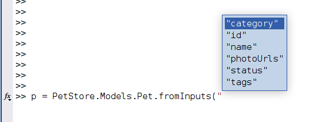
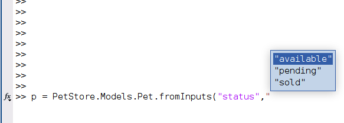
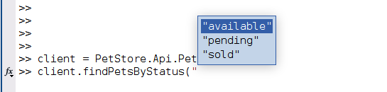

# Basic Usage

The examples below are based on the Pet Store v3 OpenAPI example which can for example be run in a Docker container:

```bash
docker run -d -e OPENAPI_BASE_PATH=/v3 -e DISABLE_OAUTH=1 -p 8080:8080 openapitools/openapi-petstore
```

This will run the Pet Store example on <http://localhost:8080>, open this URL in a web browser to see the SwaggerUI for the example.

```{note}
For simplicity OAuth is disabled in this example using environment variable `DISABLE_OAUTH=1`. In this case the OpenAPI spec of the example does still contain the OAUth definition and the appropriate [`requestAuth` and `getOAuthToken` methods](CustomizingGeneratedCode.md#authentication) will be generated in `BaseClient` but the token is not actually verified when calling the secured endpoints.
```

The MATLAB client code for this example can then be generated by running the following from a shell in the `Software` directory:

```bash
npx @openapitools/openapi-generator-cli --custom-generator Java/target/MATLAB-openapi-generator-3.0.0.jar generate -g matlab-client -i http://localhost:8080/openapi.json -o PetClient --package-name PetStore
```

If not working in the package's `Software` directory, use full paths and add the following additional arguments:

```bash
-t "<package_directory>/Software/Mustache" --additional-properties openapiRoot="<package_directory>/Software/MATLAB
```

Or by using the following commands in MATLAB:

```matlab
c = openapi.build.Client(inputSpec="http://localhost:8080/openapi.json", packageName="PetStore", output="PetClient");
c.build
```

See [BuildClient.md](BuildClient.md) for further details on using the MATLAB based build process.

The example below assumes that the generated package is called `PetStore` as was also set in the commands above. Add the directory in which the package was generated (`PetClient` in the examples above) to the MATLAB path (e.g. using `addpath`).

```{hint}
The generator is designed to generate classes with proper [help comments](https://www.mathworks.com/help/matlab/matlab_prog/create-help-for-classes.html). *Do* use the `help` function to learn more about the generated `api` and `model` classes, and their properties and methods.
```

## API Classes

The generator generates classes for all of the APIs in the spec. The classes are generated in a sub package named `api`. The API objects are used to interact with the service and hold various configuration options for interacting with the service. All API classes have the following properties:

```{eval-rst}
:serverUri:           Base URI to use when calling the API. Allows using a different server
                      than specified in the original API spec.
:httpOptions:         `HTTPOptions <https://www.mathworks.com/help/matlab/ref/matlab.net.http.httpoptions-class.html>`_ 
                      used by all requests. This for example allows configuring whether- and
                      which proxy to use for requests. Or to configure trusted HTTPS 
                      certificates and root CAs.
:preferredAuthMethod: If operation supports multiple authentication methods, specified which
                      method to prefer.
:bearerToken:         If Bearer token authentication is used, the token can be supplied 
                      here. Note the token is only used if operations are called for which
                      the API explicitly specified that Bearer authentication is supported.
                      If this has not been specified in the spec but most operations do 
                      require Bearer authentication, consider adding the relevant header to
                      all requests in the preSend method.
:apiKey:              If API key authentication is used, the key can be supplied here. 
                      Note the key is only used if operations are called for which
                      the API explicitly specified that API key authentication is supported.
                      If this has not been specified in the spec but most operations do 
                      require API key authentication, consider adding the API key to all
                      requests in the preSend method.
:httpCredentials:     If Basic or Digest authentication is supported username/password
                      credentials can be supplied here as matlab.net.http.Credentials. Note 
                      these are only actively used if operations are called for which the 
                      API spec has specified they require Basic authentication. If this has
                      not been specified in the spec but most operations do require
                      Basic authentication, consider setting the Credentials property in the
                      httpOptions rather than through httpCredentials.
:cookies:             Cookie jar. The cookie jar is shared across all API classes in the 
                      same package. All responses are automatically parsed for Set-Cookie
                      headers and cookies are automatically added to the jar. Similarly
                      cookies are added to outgoing requests if there are matching cookies 
                      in the jar for the given request. Cookies can also be added manually
                      by calling the setCookies method on the cookies property. The cookie
                      jar is also saved to disk (cookies.mat in the same directory as 
                      BaseClient) and reloaded in new MATLAB sessions.                      
```

These properties can be set as any normal MATLAB object property:

```matlab
c = PetStore.api.Pet;
c.bearerToken = "3244<MY-REDACTED-TOKEN>53abef";
```

But they can also be set when instantiating the object using Name-Value pairs where the Name matches the property name, e.g.:

```matlab
c = PetStore.api.Pet("bearerToken", "3244<MY-REDACTED-TOKEN>53abef", "apiKey", "myapikey");
```

or:

```matlab
c = PetStore.api.Pet(bearerToken="3244<MY-REDACTED-TOKEN>53abef", apiKey="myapikey");
```

### Set properties using a configuration file

These properties are rarely changed when working with a given API. To aid configuration they can be loaded from a simple JSON file rather than being explicitly set in code. This also permits an end user to change the properties without needing to alter or understand the code. Configuration files can be used to quickly switch between different servers or credentials for example.

If a configuration file named `<PackageName>.Client.Settings.json` is found on the MATLAB path, it is loaded automatically when instantiating the client objects. To load a file with different name, use the `"configFile"` Name-Value pair when instantiating the object:

```matlab
c = PetStore.api.Client("configFile","/home/username/myconfigfile.json");
```

This will search for the specified file on the MATLAB path if not specifying an absolute path.

Any additional options specified after the `"configFile"` argument, or when a `<PackageName>.Client.Settings.json` exists, allow overriding values from the configuration file. For example, suppose that the following `PetStore.Client.Settings.json` exists:

```json
{
    "serverUri": "http://localhost/v2",
    "apiKey": "myKey"
}
```

and then the following is used:

```matlab
c = PetStore.api.Client("serverUri", "http://example.com/api/v2");
```

Then the client is instantiated with the `apiKey` from the configuration file but the `serverUri` is set to `"http://example.com/api/v2"` as specified in the code.

### Calling API Operations

Operation calls are made by making method calls on API Object instances e.g. `Pet`, `Store` & `User`. If the operation has any required parameters according to its OpenAPI spec, the generated MATLAB method will have the same arguments as required positional input arguments. Any optional parameters are specified through Name-Value pairs.

To learn more about the exact arguments a methods requires and/or supports, use the `help` function in MATLAB:

```{code-block} matlabsession
---
emphasize-lines: 8-11
---
>> c = PetStore.api.Pet;
>> help c.findPetsByTags
--- help for PetStore.api.Pet/findPetsByTags ---

  findPetsByTags Finds Pets by tags
  Multiple tags can be provided with comma separated strings. Use tag1, tag2, tag3 for testing.
 
  Required parameters:
    tags - Tags to filter by, Type: array
 
  No optional parameters
 
  Responses:
    200: successful operation
    400: Invalid tag value
 
  Returns: Array of Pet
 
  See Also: PetStore.models.Pet
```

All methods always have three outputs:

1. The HTTP StatusCode of the API call.

2. The response body:

    a. Decoded into the correct model, if the call was successful and returned an expected StatusCode according to the spec, or

    b. As raw string, if there was a body but it could not be decoded (for example, if a StatusCode was returned which was not specified in the spec), or

    c. Empty, if there is no response body at all.

3. The full response of the API call as `matlab.net.http.ResponseMessage`.

So the method mentioned above can then for example be called using:

```matlabsession
>> [status, response] = c.findPetsByTags(["tag1","tag2"])

status = 

  StatusCode enumeration

    OK

response = 

  1x6 Pet array with properties:

    id
    category
    name
    photoUrls
    tags
    status
```

Or the `updatePetWithForm` method:

```{code-block} matlabsession
---
emphasize-lines: 5-10
---
>> help c.updatePetWithForm
  updatePetWithForm Updates a pet in the store with form data
  No description provided
 
  Required parameters:
    petId - ID of pet that needs to be updated, Type: int64, Format: int64
 
  Optional name-value parameters:
    name - Updated name of the pet, Type: string
    status - Updated status of the pet, Type: string
 
  Responses:
    405: Invalid input
 
  Returns:
```

Which has `petId` as required input and `name` and `status` as optional inputs, could be called as:

```matlab
% Theoretically allowed, with only required ID, not very useful though as you do
% not actually update any field for the specified pet then
[status,response] = c.updatePetWithForm(3)
% Or, more useful, with required ID and optional name
[status,response] = c.updatePetWithForm(3,"name","New Name")
% Or, with required ID and optional status
[status,response] = c.updatePetWithForm(3,"status","sold")
% Or, with require ID and both optional values
[status,response] = c.updatePetWithForm(3,"name","New Name","status","available")
```

### Cookies

The generated API classes try to automatically manage cookies. `Set-Cookie` header in responses are parsed and the returned cookies are stored in a cookie jar which is shared across all API classes in the same package. Similarly cookies are added to outgoing requests if there are relevant cookies in the jar. The cookies are saved to disk in a file named `cookies.mat` which is placed next to `BaseClient.m`, the cookies are automatically reloaded in new MATLAB sessions.

## Models

Models are objects that are used to define data structures, e.g. `Address`, `Pet`, `Category`. Models are generated in a sub package called `models`. They may be nested. In some cases they may be returned by operations (e.g. the example above returned a 1×6 array of `PetStore.models.Pet`), in some cases operations may require a model as input. When a model is required as input, some of the properties must be set, some may be optional and some may be ignored by a specific operation, for example:

```{code-block} matlabsession
---
emphasize-lines: 7-16
---
>> help c.addPet
--- help for PetStore.api.Pet/addPet ---

  addPet Add a new pet to the store
  No description provided
 
  Required parameters:
    Pet - Pet object that needs to be added to the store, Type: Pet
        Required properties in the model for this call:
            name
            photoUrls
        Optional properties in the model for this call:
            id
            category
            tags
            status
 
  No optional parameters
 
  Responses:
    405: Invalid input
 
  Returns:
```

I.e. in the example above, a `Pet` model *must* be provided as input, but only its `name` and `photoUrls` fields have to be set.

```{note}
If the API spec uses `oneOf`,`anyOf` or `allOf` combinations of models for inputs, the generator will not be able to properly determine which fields may be required or optional, in that case no required and no optional parameters are listed at all. It is then entirely up to the end-user to supply a correct model instance with the correct fields set. There will be no error checking on the MATLAB side and all fields which have a value are included in the request.
```

In MATLAB to create a model instance, simply instantiate an object of the right class:

```matlab
p = PetStore.models.Pet;
```

And then set the properties to the desired values, for example:

```matlab
p.name = "Bo"
p.photoUrls = ["http://example.com/cat.png"]
```

Models can also be nested, in the example above the `category` and `tags` properties are of type `Category` and array of `Tag` respectively. The easiest way to fill out such properties is to work with subscripted assignment. I.e. the following does *not* work:

```matlabsession
>> p = PetStore.models.Pet;
>> p.tags.name = "cats"
Property assignment is not allowed when the object is empty.  Use subscripted assignment to create an array element.
```

But as the error message also indicates "subscripted assignment" can be used to create the element and then also immediately assign a value. I.e. the following *will* work:

```matlabsession
>> p = PetStore.models.Pet;
>> p.tags(1).name = "tag1"
>> p.tags(1).id = 42;
```

And for properties which are arrays, like `tags`, this can also be used to add additional elements:

```matlabsession
>> p = PetStore.models.Pet;
>> p.tags(2).name = "tag2"
>> p.tags(2).id = 123;
```

Alternatively it is of course also possible to first create an instance of a particular model and then assign it to the property:

```matlab
p = PetStore.models.Pet;
category = PetStore.models.Category;
category.name = "cats";
category.id = 2;
p.category = category;
```

### Model constructors

All models are generated with a constructor which:

1. Can deserialize a JSON string into a model instance, and
2. Allows setting property values by providing Name-Value pairs as input.

For example, the following one-liner with Name-Value pairs can be used to immediately create a Pet instance with specified name and photoUrls instead of needing three lines for this:

```matlab
p = PetStore.models.Pet("name","Bo","photoUrls",["http://example.com/cat.png"])
```

Or with a JSON string:

```matlab
p = PetStore.models.Pet('{"name":"Bo","photoUrls":["http://example.com/cat.png"]}')
```

And this can also be used in a nested way:

```matlab
p = PetStore.models.Pet( ...
    "name","Bo", ...
    "photoUrls",["http://example.com/cat.png"], ...
    "category",PetStore.models.Category("id",2,"name","cats"));
```

Note that first JSON strings are deserialized and then the Name-Value pairs are applied, so a Name-Value pair can override a property from the JSON string, for example in:

```matlab
p = PetStore.models.Pet('{"name": "Foo"}',"name","Bar");
```

The final Pet instance will have `name` = `"Bar"` and not `"Foo"`.

### Model inheritance

In the example discussed on this documentation page, there is no inheritance between models and there is no polymorphism in the operations. These feature may be used in more complex services though and this will influence model behavior. If working with such services/specs, see [](./InheritanceAndPolymorphism.md) for more information.

## Example method call with model as input

So finally to call the `addPet` operation with a `Pet` as input:

```matlab
% Create the client with which the operation can be called
client = PetStore.api.Pet;
% Create the Pet model for the Pet which is to be added
petToAdd = PetStore.models.Pet( ...
    "name","Bo", ...
    "photoUrls",["http://example.com/cat.png"], ...
    "category",PetStore.models.Category('{"id":2,"name":"cats"}'));
% Call the method
status = client.addPet(petToAdd)
```

## Enumeration handling

For enumeration model properties, MATLAB enumerations are generated. These are also part of the `models` sub package. For example in the `Pet` model, the `status` property is of type `PetStore.models.PetStatusEnum`. As always in MATLAB, enums can be set using actual enum instances:

```matlab
p = PetStore.models.Pet;
p.status = PetStore.models.PetStatusEnum.available;
```

or using their string equivalent:

```matlab
p.status = "available";
```

And this can also be used in a constructor again:

```matlab
p = PetStore.models.Pet("status",PetStore.models.PetStatusEnum.available);
% Or
p = PetStore.models.Pet("status","available");
```

This fully integrates with MATLAB Tab completion. Typing `p = PetStore.models.Pet(` and then hitting [Tab] should show all properties:



And after choosing an enumeration property hitting [Tab] again should show the available enumerations:



For enumerations which are direct inputs to an operation and which are not part of an model, the generator does not generate actual MATLAB enums but it does generate input argument validation using `{mustBeMember}` which also offers tab completion, for example for the `getPetsByStatus` operation:



[//]: #  (Copyright 2020-2023 The MathWorks, Inc.)
